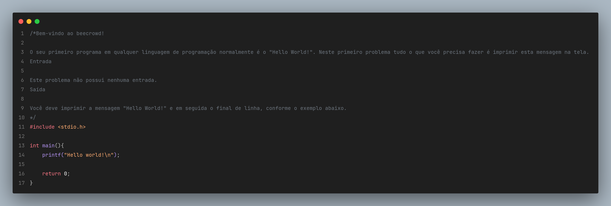

# Lista 00 - Fundamentos em C

Esta pasta contém a **Lista 00** da disciplina de **Programação de Computadores** do curso de **Ciência da Computação - Unisantos**.

Os exercícios desta etapa são introdutórios e servem para consolidar os primeiros contatos com a linguagem C por meio de problemas do **Beecrowd**.

---

## Objetivos da lista

Durante a resolução dos exercícios são praticados conceitos como:

- uso de **bibliotecas básicas**, como `stdio.h`
- **entrada e saída de dados** com `scanf` e `printf`
- **declaração de variáveis**
- **operações aritméticas**
- **formatação de saída**
- **lógica inicial de programação**

---

## Exercícios resolvidos

| Exercício | Descrição | Imagem |
|----------|-----------|--------|
| ex00 | Hello World |  |
| ex01 | Área do círculo | - |
| ex02 | Diferença entre produtos | - |
| ex03 | Cálculo de salário de funcionário | - |
| ex04 | Valor a pagar por peças | - |
| ex05 | Volume da esfera | - |
| ex06 | Consumo médio de combustível | - |

Os enunciados originais podem ser encontrados no site do **Beecrowd**.

---

## Como compilar

Para compilar um dos exercícios utilizando **GCC**:

```bash
gcc ex01.c -o ex01.out
./ex01.out
```
