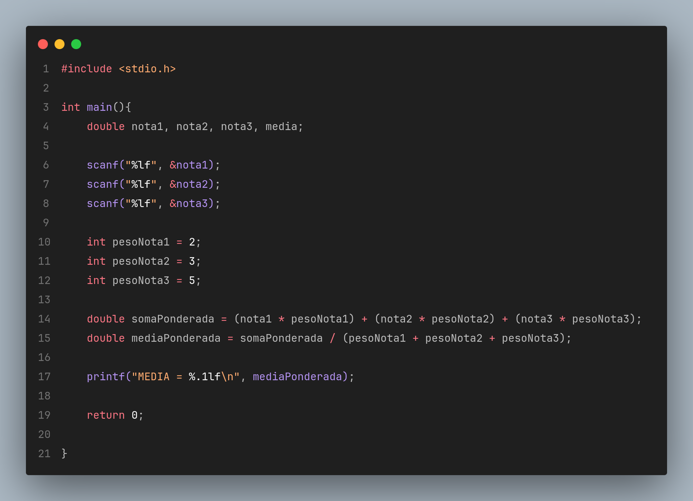
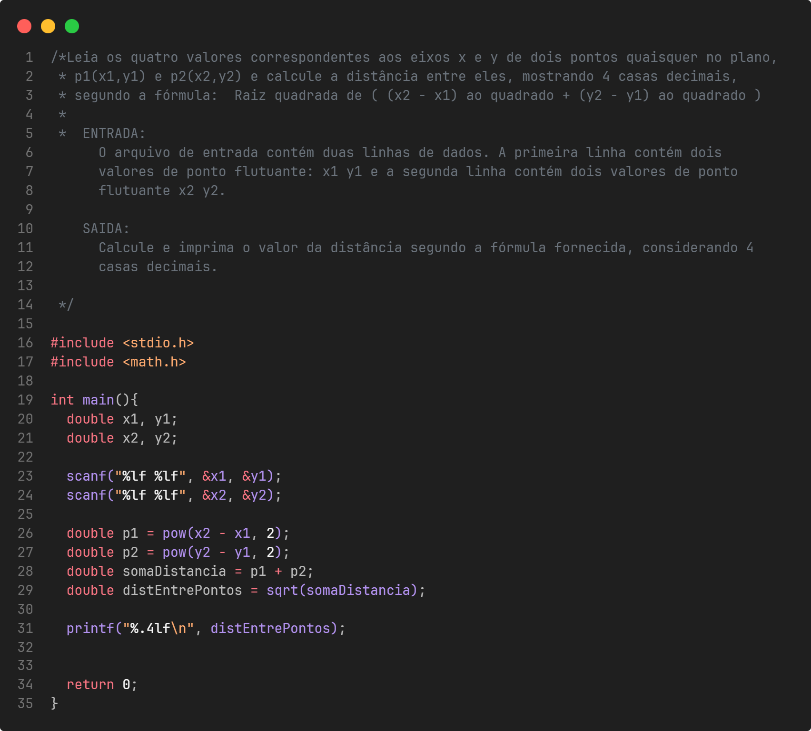

# Lista 01 - Calculos e Conversoes

Esta pasta reúne a **Lista 01** da disciplina de **Programação de Computadores** do curso de **Ciência da Computação - Unisantos**.

Os exercícios aprofundam o uso de variáveis, fórmulas matemáticas e transformações de dados de entrada em diferentes formatos de saída.

---

## Objetivos da lista

Durante a resolução dos exercícios são praticados conceitos como:

- **média ponderada**
- **conversão de unidades de tempo e idade**
- **operações com resto da divisão**
- **distância entre pontos no plano cartesiano**
- **decomposição de valores em cédulas**
- **cálculo de raízes por Bhaskara**

---

## Exercícios resolvidos

| Exercício | Descrição | Imagem |
|----------|-----------|--------|
| ex07 | Média ponderada de três notas |  |
| ex08 | Conversão de segundos para `horas:minutos:segundos` | - |
| ex09 | Conversão de idade em dias para anos, meses e dias | - |
| ex10 | Resto da divisão entre dois inteiros | - |
| ex11 | Distância entre dois pontos no plano |  |
| ex12 | Decomposição de valor inteiro em cédulas | - |
| ex13 | Cálculo das raízes de uma equação do segundo grau | - |

Os enunciados originais podem ser encontrados no site do **Beecrowd**.

---

## Como compilar

Para compilar um dos exercícios utilizando **GCC**:

```bash
gcc ex07.c -o ex07.out
./ex07.out
```
