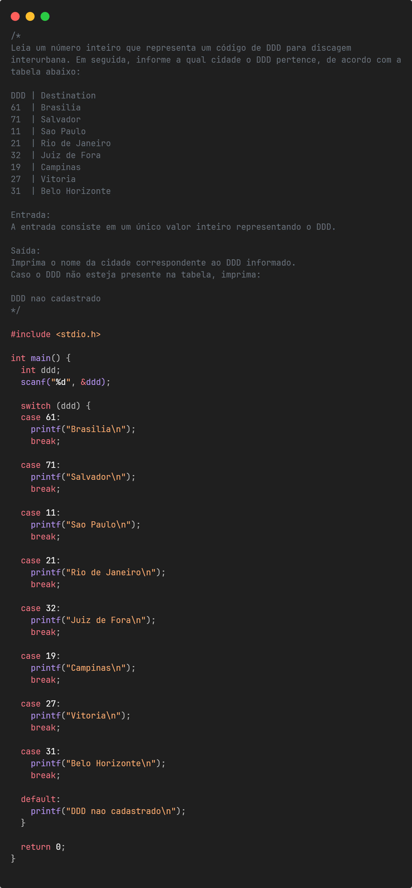

# Lista 02 - Condicionais e Selecao

Esta pasta reúne a **Lista 02** da disciplina de **Programação de Computadores** do curso de **Ciência da Computação - Unisantos**.

Os exercícios desta lista enfatizam tomadas de decisão com `if`, `else if`, `else` e `switch`, associando condições a saídas específicas.

---

## Objetivos da lista

Durante a resolução dos exercícios são praticados conceitos como:

- **comparação entre valores**
- **seleção por faixas e intervalos**
- **validação de regras de entrada**
- **tabelas de decisão**
- **classificação de dados**
- uso de **estruturas condicionais** e **switch case**

---

## Exercícios resolvidos

| Exercício | Descrição | Imagem |
|----------|-----------|--------|
| ex14 | Identificação do maior entre três valores | - |
| ex15 | Decomposição de valor monetário em notas e moedas | - |
| ex16 | Validação de quatro valores segundo regras específicas | - |
| ex17 | Verificação de intervalo numérico | - |
| ex18 | Cálculo de total em cardápio por código do item | - |
| ex19 | Reajuste salarial por faixa de salário | - |
| ex20 | Consulta de cidade a partir do DDD | - |
| ex21 | Cálculo da duração de um evento em dias, horas, minutos e segundos | - |
| ex22 | Contagem de valores pares | - |
| ex23 | Contagem de pares, ímpares, positivos e negativos | - |
| ex24 | Conversão de nota numérica em conceito por letras |  |

Os enunciados originais podem ser encontrados no site do **Beecrowd**.

---

## Como compilar

Para compilar um dos exercícios utilizando **GCC**:

```bash
gcc ex14.c -o ex14.out
./ex14.out
```
