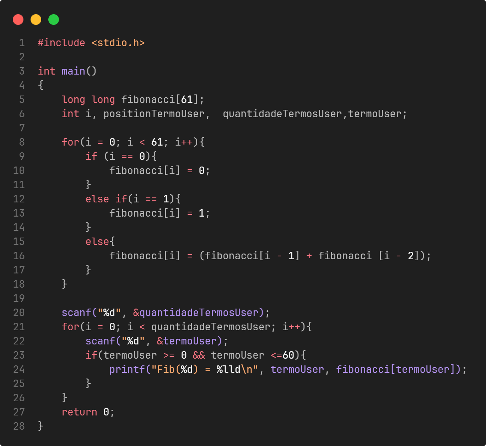
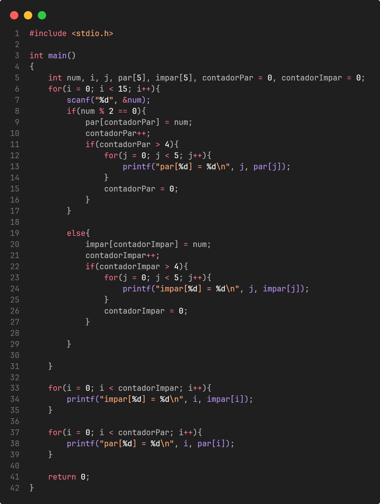
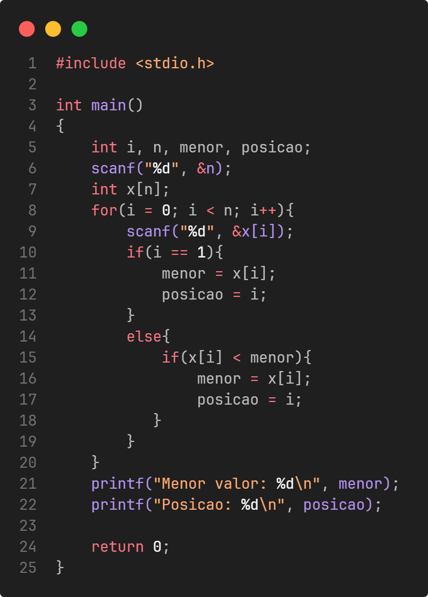

# Lista 04 - Vetores

Esta pasta reúne a **Lista 04** da disciplina de **Programação de Computadores** do curso de **Ciência da Computação - Unisantos**.

Os exercícios desta etapa são voltados ao uso de **vetores**, preenchimento de posições, percursos, filtros, inversão e armazenamento de sequências.

---

## Objetivos da lista

Durante a resolução dos exercícios são praticados conceitos como:

- **declaração e preenchimento de vetores**
- **percorrer arrays com laços**
- **substituição e transformação de valores**
- **inversão de ordem**
- **armazenamento de sequências**
- **busca por menor valor e posição**

---

## Exercícios resolvidos

| Exercício | Descrição | Imagem |
|----------|-----------|--------|
| ex37 | Substituição de valores nulos ou negativos por `1` em vetor | - |
| ex38 | Preenchimento de vetor dobrando o valor anterior | - |
| ex39 | Exibição dos valores de um vetor menores ou iguais a `10` | - |
| ex40 | Inversão da ordem de um vetor com 20 posições | - |
| ex41 | Consulta de termos da sequência de Fibonacci com vetor |  |
| ex42 | Preenchimento de vetor com sequência repetida de `0` até `T-1` | - |
| ex43 | Preenchimento de vetor reduzindo o valor pela metade a cada posição | - |
| ex44 | Separação inicial de valores pares e ímpares em vetores | - |
| ex45 | Armazenamento e impressão de pares e ímpares em vetores auxiliares |  |
| ex46 | Busca do menor valor e da posição correspondente no vetor |  |

Os enunciados originais podem ser encontrados no site do **Beecrowd**.

---

## Como compilar

Para compilar um dos exercícios utilizando **GCC**:

```bash
gcc ex37.c -o ex37.out
./ex37.out
```
